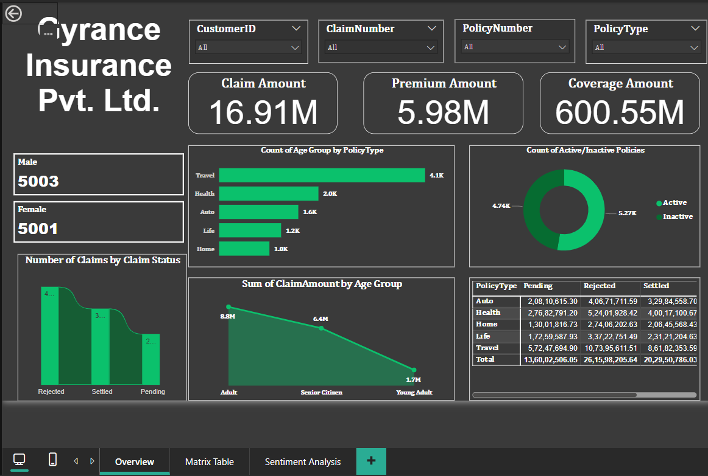

# 🧾 Power BI Project – Insurance Data Dashboard

## 📝 Project Overview
This Power BI report presents an interactive dashboard built on insurance industry data. It enables stakeholders to monitor key business metrics such as policy distribution, claim trends, customer demographics, and revenue performance.

## 📁 Files Included
- `InsuranceDB.pbix` – Power BI report file with data model, visuals, and DAX measures
- `dashboard_screenshot.png` – Dashboard preview 

## 📊 Key Features
- **Policy Type Distribution:** Visual breakdown of policies by type and region  
- **Claims Analysis:** Trends in claims raised, settled, and pending  
- **Customer Segmentation:** Insights by age group, gender, and location  
- **Revenue Metrics:** Premiums collected, claim ratios, and profitability  
- **Dynamic Slicers:** Filter by time, region, and policy categories

## 📸 Dashboard Screenshot

