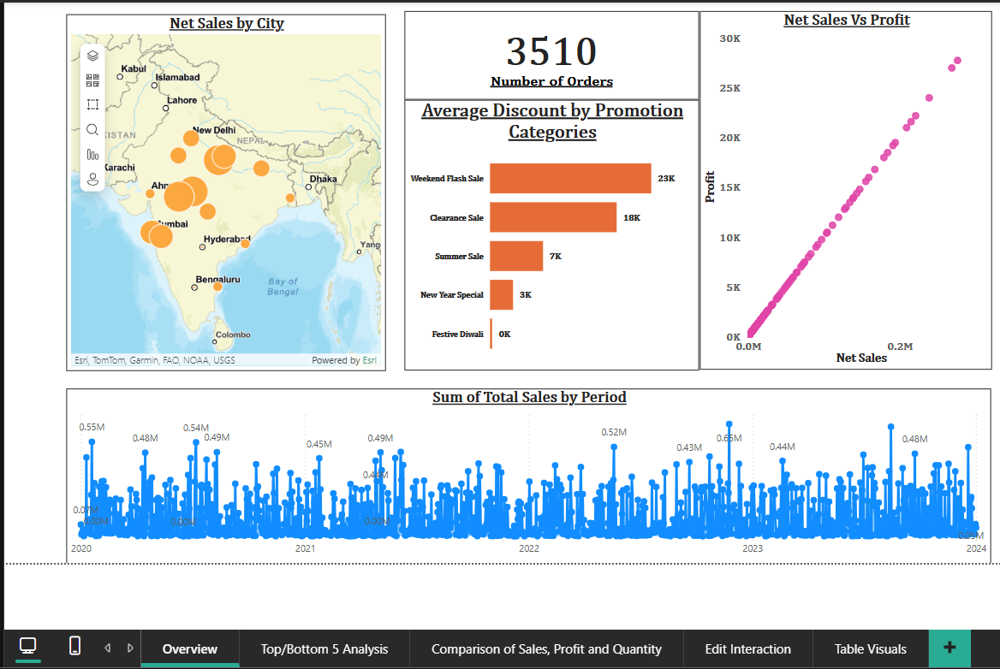

# 📊 Power BI Project – Sales Data Analysis Dashboard

## 📝 Project Overview
This Power BI report provides an interactive dashboard for analyzing sales performance across various product categories, regions, and time periods. It enables users to identify sales trends, evaluate top-performing products, and make data-driven decisions to optimize business strategies.

## 📁 Files Included
- `Sales Data Analysis.pbix` – Main Power BI report with data model, visuals, and DAX calculations
- `dashboard_screenshot.png` – Screenshot preview of the dashboard (to be added)

## 📌 Key Insights
- Overall sales trends over time (monthly, quarterly, yearly)
- Top-performing products and categories by revenue
- Region-wise sales performance
- Contribution of different customer segments to total sales
- Filters and slicers to drill into specific periods or segments

## 🔧 Tools & Techniques Used
- **Power BI Desktop**
- **DAX** (for calculated columns, KPIs, and dynamic measures)
- **Power Query Editor** (for data cleaning and transformation)
- Time Intelligence functions (YTD, MoM Growth, etc.)

## 🎯 Objective
To design a sales dashboard that presents complex data in a visually intuitive format, empowering business users to monitor key metrics, identify opportunities, and act on insights quickly.

## 📸 Dashboard Screenshot

